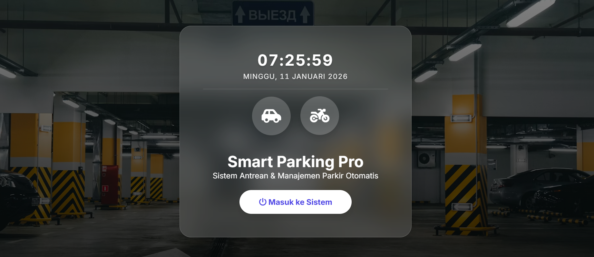

# 🅿️ Smart Parking Pro

**Sistem Manajemen Parkir Hybrid (Manual & Simulasi)** Aplikasi berbasis web modern untuk mengelola operasional parkir kendaraan (Mobil & Motor). Mendukung mode input manual untuk penggunaan nyata dan mode simulasi otomatis untuk demonstrasi sistem.


*(Ganti link gambar di atas dengan screenshot dashboard Anda)*

## 🌟 Fitur Utama

Sistem ini dirancang dengan dua mode operasional yang dapat diganti secara instan:

###  🎹 Mode Manual (Operasional Nyata)
Mode ini digunakan untuk petugas parkir di lapangan.
* **Input Langsung:** Form input cepat untuk Plat Nomor, Jenis Kendaraan, dan Slot Parkir (Teks Bebas).
* **Sistem Checkout Canggih:**
    * Pencarian data berdasarkan Plat Nomor.
    * **Karcis Digital:** Menampilkan durasi parkir dan total biaya secara otomatis.
    * Validasi agar kendaraan tidak bisa keluar jika belum masuk.
* **UI Bersih:** Tampilan 2 kolom yang fokus pada input data dan tabel monitoring.

###  🤖 Mode Live Simulasi (Demo/Testing)
Mode ini digunakan untuk presentasi atau pengujian beban sistem.
* **Traffic Generator:** Kendaraan datang secara otomatis dengan interval acak.
* **Antrean Masuk:** Sistem antrean visual sebelum kendaraan mendapatkan slot.
* **Proses Admin:** Admin menyetujui kendaraan dari antrean dan memilihkan slot (L1-A, VIP, dll).
* **Random Exit:** Kendaraan akan keluar secara acak untuk mensimulasikan dinamika parkiran.

###  📊 Fitur Umum
* **Real-time Dashboard:** Jam digital live dan status parkir yang update tanpa refresh.
* **Laporan Riwayat:** Mencatat setiap transaksi selesai (Plat, Jam Masuk/Keluar, Pendapatan).
* **Filter Tanggal:** Melihat pendapatan pada tanggal tertentu.
* **Penyimpanan Lokal:** Menggunakan `localStorage`, data tidak hilang saat browser di-refresh.
* **Responsive Design:** Tampilan menyesuaikan layar Desktop dan Tablet.

## 🛠️ Teknologi yang Digunakan

* **Frontend:** HTML5, CSS3 (Custom Grid & Flexbox, Animasi Keyframes).
* **Styling:** Modern UI dengan Glassmorphism effect dan Interactive Elements.
* **Logic:** Vanilla JavaScript (ES6+).
* **Icons:** FontAwesome 6.
* **Data Persistence:** Browser LocalStorage API (No SQL Database required for basic usage).
* *(Optional)* **Backend:** PHP Classes (`Kendaraan`, `Mobil`, `Motor`) tersedia untuk pengembangan lebih lanjut ke database server.

## 📂 Struktur Folder

```text
smart-parking-pro/
│
├── index.html      # Halaman utama aplikasi (Single Page Application layout)
├── style.css       # Styling, animasi, dan layout responsif
├── script.js       # Logika bisnis, simulasi, dan manipulasi DOM
├── classes.php     # (Opsional) Kerangka Class PHP untuk backend
├── api.php         # (Opsional) Endpoint API
└── README.md       # Dokumentasi proyek
